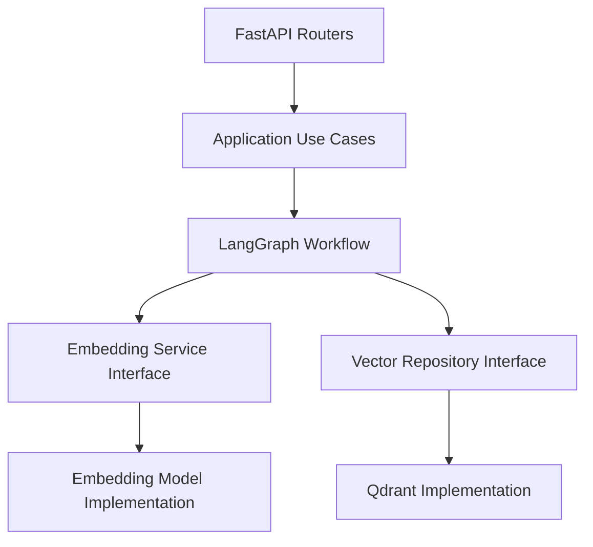

# Messy LangGraph + Qdrant Onboarding Exercise

## Overview

This repository contains a functional FastAPI application that integrates **LangGraph** and **Qdrant** for document ingestion and semantic search.

The system works end-to-end but is intentionally implemented in an unstructured way. Important engineering practices such as separation of concerns, explicit dependency management, and testability are deliberately missing.

The purpose of this exercise is **not to refactor the code immediately**, but to analyze the existing design, identify architectural issues, and propose a clear and incremental path toward a more maintainable and production-ready architecture.

---

## What Works Well

Despite its limitations, the current implementation demonstrates several positive aspects:

- The application runs successfully and exposes clear API endpoints.
- LangGraph is used effectively to model a retrieval → generation workflow.
- Qdrant is integrated for vector storage and similarity search.
- The system behavior is observable and easy to follow at runtime.
- The code favors simplicity and avoids premature abstraction.

These strengths provide a solid foundation for iterative improvement.

---

## Design Smells & Issues Observed

### 1. Global State and Implicit Dependencies

Several critical components are stored as global variables, including the Qdrant client, workflow instance, in-memory state, and counters.

**Impact:**
- Risk of race conditions in concurrent environments
- Hidden dependencies that are difficult to reason about
- Reduced testability and limited isolation
- Side effects that span multiple requests

---

### 2. Lack of Separation of Concerns

The `main.py` file contains multiple responsibilities at once:
- HTTP request handling
- Business logic
- Workflow orchestration
- Database access
- Embedding generation
- Configuration management

This makes the code harder to understand, modify, and test in isolation.

---

### 3. Tight Coupling to Infrastructure

Business logic and workflows depend directly on:
- The Qdrant SDK
- A concrete embedding implementation

As a result:
- Changing the vector database would require changes across the codebase
- Introducing a new embedding model would affect multiple layers

---

### 4. Limited Testability

- No dependency injection
- No clear boundaries between logic and side effects
- External services cannot be easily mocked
- Unit testing requires bootstrapping the full application

---

### 5. Hardcoded Configuration

Environment-specific values such as host, port, collection name, and embedding dimensions are hardcoded, making the application fragile across different environments (local, staging, production).

---

## Proposed Target Architecture

The following diagram illustrates a cleaner separation of responsibilities and a more maintainable dependency direction.

### Architecture Explanation

- **FastAPI Routers** are responsible only for HTTP concerns such as request parsing and response formatting.
- **Application Use Cases** represent business actions and orchestrate workflows without knowing infrastructure details.
- **LangGraph Workflow** models domain logic and coordinates steps like retrieval and answer generation.
- **Interfaces** define contracts for embedding generation and vector storage without binding to specific technologies.
- **Implementations** encapsulate external systems such as Qdrant and embedding models.

This design follows the Dependency Inversion Principle and improves clarity, extensibility, and testability.

## Refactoring Priorities

If refactoring were to begin, the highest-impact priorities would be:

1. Remove global state and introduce explicit dependency injection
2. Decouple business logic from FastAPI routing
3. Introduce interfaces for embedding and vector storage
4. Centralize configuration management
5. Isolate side effects to improve testability

## Incremental Migration Strategy

To preserve existing behavior and minimize risk, refactoring should be performed incrementally rather than through a large rewrite.

The proposed migration steps are:

1. **Introduce environment-based configuration**  
   Move hardcoded values (host, port, collection name, embedding dimensions) into environment variables or a centralized configuration module.

2. **Wrap Qdrant access behind a repository interface**  
   Introduce a vector repository abstraction so that the rest of the application is not tightly coupled to Qdrant-specific APIs.

3. **Move embedding logic into a dedicated service**  
   Encapsulate embedding generation behind an interface to allow easy replacement or extension of embedding models.

4. **Refactor LangGraph nodes to accept dependencies explicitly**  
   Pass required services (embedding, vector repository) into workflow nodes instead of relying on global state.

5. **Gradually eliminate global variables**  
   Replace shared global state with dependency injection and well-defined application lifecycles.

6. **Add unit tests before removing legacy paths**  
   Ensure current behavior is captured by tests to reduce regression risk during refactoring.

7. **Introduce integration tests for API endpoints**  
   Validate end-to-end behavior using controlled environments or in-memory dependencies.

This approach allows the system to evolve safely while maintaining functionality and reducing the risk of breaking changes.

---

## Testing Strategy

### Unit Testing

Unit tests should focus on validating behavior in isolation:

- LangGraph workflow nodes tested with mocked services
- Embedding generation logic tested independently
- Vector repository behavior validated through interface-based mocks

### Integration Testing

Integration tests should verify system behavior across boundaries:

- FastAPI endpoints tested using test clients
- Vector database interactions tested using in-memory or containerized Qdrant instances
- Configuration loading validated across different environments

---

## Final Conclusion

This base code is not a failure; it reflects realistic compromises made under time pressure.

The value of this exercise lies in recognizing architectural limitations, understanding their impact, and developing the system in a planned manner rather than relying on risky, large-scale rewrites.

The proposed approach prioritizes clarity, explicit dependencies, and sustainable growth while maintaining existing functionality.

