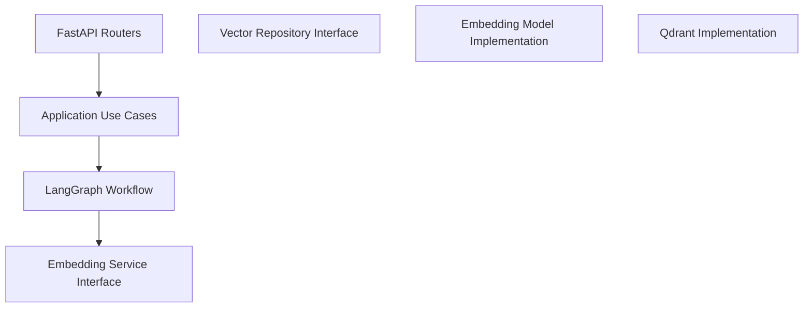

# System Architecture

This document describes the current state of the application architecture, the identified design issues, and the proposed target architecture for improving maintainability, testability, and extensibility.

---

## Current Architecture Overview

The current implementation combines multiple responsibilities into a single module:

- FastAPI routing and request handling
- Business logic and workflow orchestration
- Embedding generation
- Vector database access
- Global state management

Most components rely on **global variables** and **implicit dependencies**, which introduces tight coupling and makes the system harder to test and evolve safely.

---

## Key Architectural Issues

The main issues identified in the current architecture are:

- **Global state usage**  
  Shared global variables are used for clients, workflows, and counters, creating risks in concurrent environments.

- **Tight coupling**  
  Business logic depends directly on infrastructure details such as Qdrant and embedding implementations.

- **Low testability**  
  Components cannot be tested in isolation without bootstrapping the full application.

- **Hardcoded configuration**  
  Environment-specific values are embedded directly in code, limiting portability across environments.

---

## Proposed Target Architecture

The following diagram illustrates a cleaner separation of responsibilities and a more maintainable dependency direction.

## Architecture Explanation

### FastAPI Routers
Handle HTTP concerns only, such as request parsing, validation, and response formatting.  
This layer does not contain business logic and acts purely as an interface adapter.

### Application Use Cases
Represent business actions and orchestrate workflows without direct knowledge of infrastructure details.  
They coordinate interactions between workflows and domain services.

### LangGraph Workflow
Encapsulates domain logic and coordinates steps such as document retrieval and answer generation.  
This layer models the application flow independently from web frameworks and databases.

### Embedding Service Interface
Defines a contract for embedding generation, allowing multiple implementations without affecting business logic.  
This enables easy replacement or extension of embedding models.

### Vector Repository Interface
Abstracts vector storage and search operations, decoupling the system from a specific database technology.  
Business logic depends only on this abstraction, not on Qdrant directly.

### Implementations
Concrete implementations encapsulate external systems such as Qdrant and embedding models.  
They are isolated behind interfaces and can be swapped without impacting higher-level logic.

This design follows the **Dependency Inversion Principle**, ensuring that high-level logic depends on abstractions rather than concrete implementations.

---

## Benefits of the Proposed Architecture

- Improved separation of concerns
- Reduced coupling between components
- Easier unit and integration testing
- Safer evolution and extensibility
- Clearer onboarding experience for new engineers

    WF --> VR

    ES --> EMB
    VR --> QD

